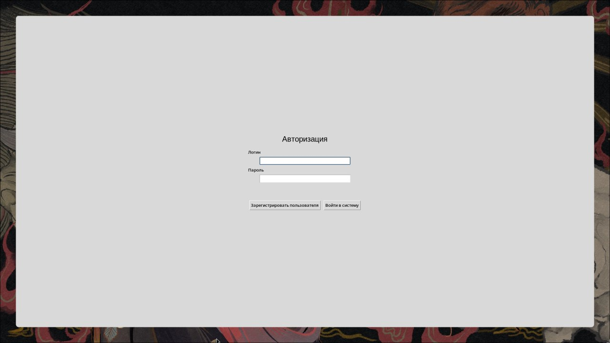
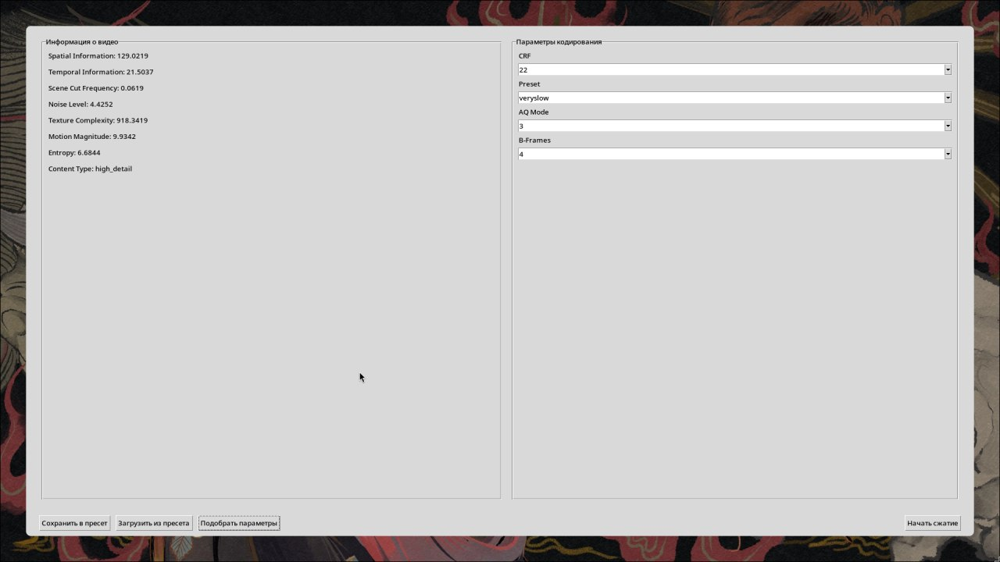
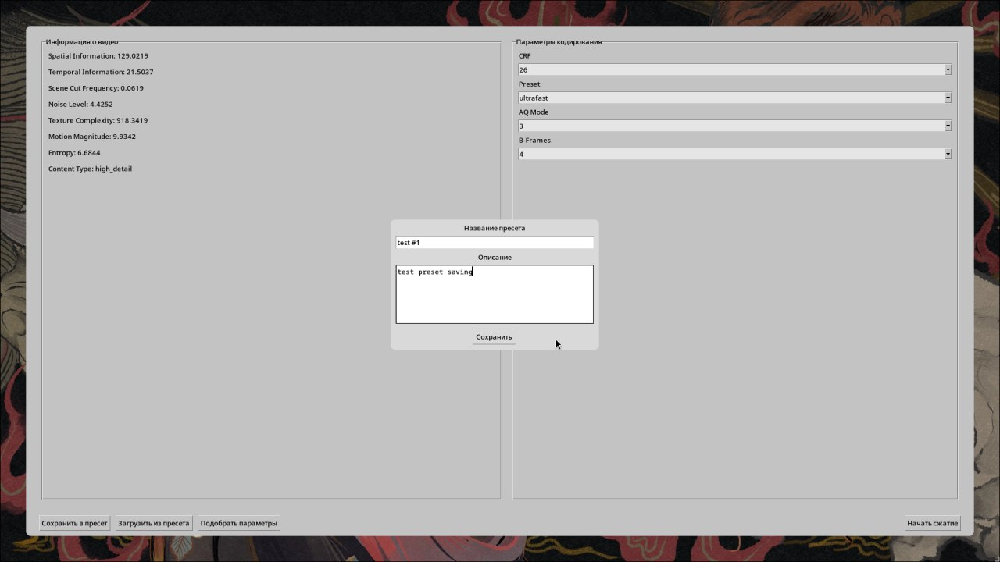
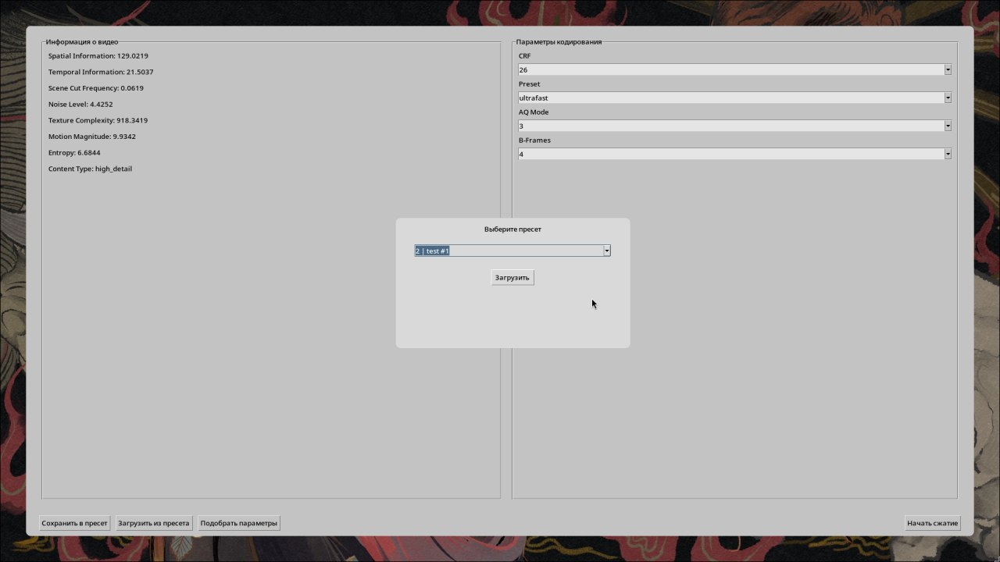
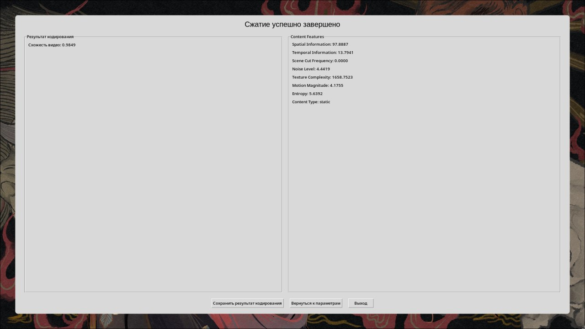

# Программная система автоматического подбора параметров кодирования видео

---

Для запуска требуется операционная система `Ubuntu`

## Первый вариант: автоматический

### Клонирование репозитория

```bash
git clone <URL_репозитория>
cd <имя_репозитория>
```

### Автоматическая установка

```bash
chmod +x setup.sh
./setup.sh
```

### Запуск программы

```bash
source .venv/bin/activate
python3 main.py
```

## Первый вариант: ручной

### 1. Установка необходимых компонентов

```bash
sudo apt update
sudo apt install -y python3 python3-venv python3-pip git ffmpeg
```

#### Проверить установку FFmpeg:

```bash
ffmpeg -version
ffprobe -version
```

---

### 2. Подготовка к запуску проекта

```bash
git clone <URL_репозитория>
cd <имя_репозитория>
```
#### Создание виртуального окружения

```bash
python3 -m venv .venv
source .venv/bin/activate
```

#### Установка зависимостей

```bash
pip install -r requirements.txt
```

---

### 3. Запуск программы

```bash
python3 main.py
```

---

## Первый запуск

При первом запуске база данных будет создана автоматически.

---

## Работа с программой

1. Зарегистрируйтесь или войдите в систему.
2. Выберите видеофайл.
3. Выполните анализ видео.
4. Настройте параметры кодирования вручную или загрузите сохраненный пресет.
5. Запустите процесс сжатия.
6. После завершения кодирования ознакомьтесь с результатами и значением метрики SSIM.

## Screenshots







